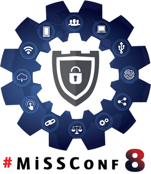

## [#MiSSConf8](https://missconf.github.io/8)

+ Date : **(Sat) April 27, 2024**
+ Venue : **[Faculty of Public Health, Mahidol University](https://maps.app.goo.gl/2u52DswotDRD1crs5)**
+ Online Registration : **(Fri) April 19, 2024** (20:00) --> [https://MiSSConf8.eventbrite.com](https://MiSSConf8.eventbrite.com)

|:-----------:|:---------------------------------------------------------------------------------------------------------------:|
|     Time    |      Agenda																				                		|
|:-----------:|:---------------------------------------------------------------------------------------------------------------:|
| 08:45-09:15 | --- **Registration** ---                                                                                        |
| 09:15-09:30 | **Welcome Address & Lucky Draw**  --- [Mr. Maykin Warasart](#), [iKNEX (Thailand)](https://iknex.or.th)      |
| 09:30-10:15 | **ระดับความเสี่ยงที่ยอมรับได้ (Risk appetite) ของประเทศไทยควรอยู่ตรงไหน**  [[Slide!](8/Slides/NCSA.pdf)] --- [AVM Jadet Khuhakongkit](https://www.facebook.com/jadetk)  Assistant Secretary General, National Cyber Security Agency (NCSA)|
| 10:15-10:30 | --- **Coffee Break** --- |
| 10:30-11:15 | **Safeguarding your LLM, Chatbot, RAG with Guardrail** [[Slide!](8/Slides/Guardrail.pdf)] --- [Mr. Sathapon Patanakuha](https://www.facebook.com/banksathapon)  CEO, Guardian GPT                                                |
| 11:15-12:00 | **เราจะมาแฮกแอปดูดเงินคืนกัน**  --- [Mr. Pichaya Morimoto](https://www.facebook.com/index.htmli) & [Mr. Sirichai Chulee](https://www.facebook.com/jame.sirichaiz)  Siam Thanat Hack Company Limited  |
| 12:00-13:15 | --- **Lunchtime** ---                                                                                                                                                                                |
| 13:15-14:00 | **Unmasking Kubernetes Secrets: Exploring the Hidden Risks of Sensitive Data Storage**  --- [Mr. Damrongsak Reetanon](https://www.facebook.com/damrongsak)  Chief Cyber Security Officer, MFEC |
| 14:00-14:45 | **Top 10 Security Design Principles You Must Know**  --- [Mr. Narudom Roongsiriwong](https://www.facebook.com/narudomr)  SVP, Global Enterprise Architecture and Cyber Security  Banpu Public Company Limited.              |
| 14:45-15:00 | --- **Coffee Break** --- |
| 15:00-15:45 | **Security Operations with Microsoft Sentinel**  --- [Mr. Wisit Thongphoo](https://www.facebook.com/wt.sectalks)  Microsoft Most Valuable Professional (MVP) - Security |
| 15:45-16:00 | **"Lucky Draw & Closing"** |

## Our Sponsors:

## Previous Events:
* [MiSSConf(SP7)](https://www.techtalkthai.com/missconfsp7-registration/)
* [MiSSConf(SP6)](https://www.techtalkthai.com/missconf-sp6-virtual-event-registration/)
* [MiSSConf(SP5)](https://www.techtalkthai.com/misscoinf-sp5-date-and-agenda-are-announced/)[[➳](https://www.facebook.com/notes/2450050635052739/)]
* [MiSSConf(SP4.0)](https://www.techtalkthai.com/missconfsp4-0-registration-will-start-in-2018-03-16/)[[➳](https://www.facebook.com/notes/1998382990191517)]
* [MiSSConf(SP3)](https://www.techtalkthai.com/missconfsp3-registration-date-is-marked-at-march-15th-2017-12-00/)[[➳](https://www.facebook.com/notes/1590473300982490)]
* [MiSSConf(SP2)](https://www.techtalkthai.com/missconfsp2-tickets-will-be-available-for-free-at-noon-of-2016-11-03/)[[➳](https://www.facebook.com/notes/1435209959842159)]
* [MiSSConf(SP1)](https://www.techtalkthai.com/introduce-to-missconfsp1-free-it-security-seminar/)[[➳](https://www.facebook.com/notes/1292590137437476)]
* [MiSSDay](https://www.techtalkthai.com/it-connect-miss-day/)[[➳](https://www.facebook.com/notes/1257877097575447)]

## For more information:
**Maykin Warasart** *(maykin@iknex.or.th)*
